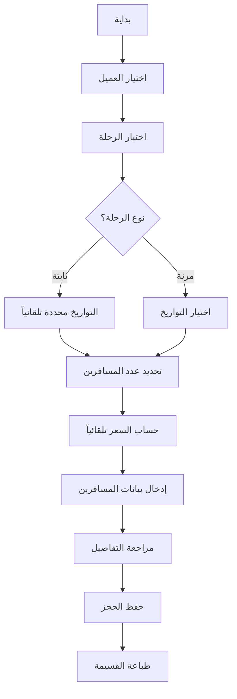
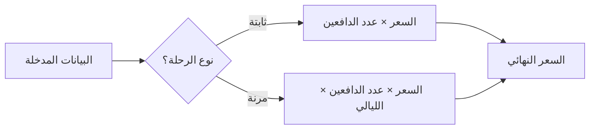

# 🎫 نظام حجز الرحلات - دليل شامل

## 📋 جدول المحتويات
1. [نظرة عامة](#نظرة-عامة)
2. [أنواع الرحلات](#أنواع-الرحلات)
3. [نظام تسعير المسافرين](#نظام-تسعير-المسافرين)
4. [طريقة حساب الأسعار](#طريقة-حساب-الأسعار)
5. [بيانات الحجز](#بيانات-الحجز)
6. [أمثلة عملية](#أمثلة-عملية)
7. [الإعدادات القابلة للتخصيص](#الإعدادات-القابلة-للتخصيص)

---

## 🌟 نظرة عامة

نظام حجز الرحلات هو نظام مرن ومتقدم يدعم نوعين من الرحلات مع نظام تسعير ذكي يميز بين فئات المسافرين المختلفة.

### المميزات الرئيسية:
- ✅ دعم نوعين من الرحلات (ثابتة ومرنة)
- ✅ نظام تسعير عادل للأطفال
- ✅ دعم عملتين (جنيه مصري ودولار أمريكي)
- ✅ حساب تلقائي للأسعار
- ✅ إمكانية تخصيص سن الطفل
- ✅ طباعة قسائم الحجز

---

## 🗺️ أنواع الرحلات

### 1. الرحلات الثابتة (Fixed Trips)

#### الوصف:
رحلات بتواريخ وبرنامج محدد مسبقاً، يتم حجزها كباقة كاملة.

#### الخصائص:
- **تاريخ البداية**: محدد مسبقاً
- **تاريخ النهاية**: محدد مسبقاً
- **المدة**: ثابتة لا تتغير
- **السعر**: سعر ثابت للشخص الواحد للرحلة كاملة
- **المرونة**: منخفضة (التواريخ محددة)

#### مثال:
```
رحلة شرم الشيخ لمدة 5 أيام
- تاريخ البداية: 2025-12-15
- تاريخ النهاية: 2025-12-20
- السعر: 3000 جنيه للفرد
- البرنامج: محدد مسبقاً
```

#### متى تستخدم الرحلات الثابتة؟
- ✅ رحلات جماعية منظمة
- ✅ رحلات بمواعيد محددة (عطلات، مناسبات)
- ✅ رحلات بأعداد محدودة

---

### 2. الرحلات المرنة (Flexible Trips)

#### الوصف:
رحلات يمكن للعميل اختيار تواريخها حسب رغبته وحسب التوافر.

#### الخصائص:
- **تاريخ البداية**: يختاره العميل (بعد تاريخ التوافر)
- **تاريخ النهاية**: يختاره العميل
- **المدة**: مرنة (العميل يحدد عدد الليالي)
- **السعر**: سعر الشخص لليلة الواحدة
- **المرونة**: عالية (العميل يختار التواريخ والمدة)

#### مثال:
```
رحلة الغردقة (مرنة)
- تتوفر من: 2025-12-01
- سعر الليلة: 600 جنيه للفرد
- العميل يختار:
  - تاريخ الوصول: 2025-12-10
  - تاريخ المغادرة: 2025-12-15
  - عدد الليالي: 5 ليالي
```

#### متى تستخدم الرحلات المرنة؟
- ✅ رحلات فردية أو عائلية
- ✅ رحلات على مدار العام
- ✅ رحلات تتطلب مرونة في المواعيد

---

## 👥 نظام تسعير المسافرين

النظام يدعم ثلاث فئات من المسافرين:

### 1. البالغون (Adults)
- **العمر**: 18 سنة فأكثر
- **التسعير**: السعر الكامل
- **إلزامي**: نعم (الحد الأدنى: 1 بالغ)

### 2. الأطفال المدفوعون (Children 12+)
- **العمر**: من 12 سنة حتى أقل من 18 سنة (قابل للتخصيص)
- **التسعير**: يُحسبون كبالغين (السعر الكامل)
- **السبب**: يحتاجون نفس الخدمات والمساحة

### 3. الأطفال المجانيون (Free Children)
- **العمر**: أقل من 12 سنة (قابل للتخصيص)
- **التسعير**: مجاناً (0 جنيه)
- **السبب**: لا يحتاجون مقاعد أو خدمات إضافية

### ⚙️ تخصيص سن الطفل
يمكن تغيير سن الحد الفاصل من ملف `.env`:
```env
CHILD_AGE_THRESHOLD=12
```

**أمثلة:**
- إذا كان `CHILD_AGE_THRESHOLD=10`:
  - أقل من 10 سنوات → مجاني
  - 10 سنوات فأكثر → يُحسب كبالغ

- إذا كان `CHILD_AGE_THRESHOLD=15`:
  - أقل من 15 سنة → مجاني
  - 15 سنة فأكثر → يُحسب كبالغ

---

## 💰 طريقة حساب الأسعار

### الرحلات الثابتة (Fixed Trips)

#### المعادلة:
```
السعر الإجمالي = (عدد البالغين + عدد الأطفال 12+) × سعر الفرد
```

#### الخطوات:
1. تحديد سعر الفرد للرحلة الكاملة
2. حساب عدد الأشخاص الدافعين (بالغين + أطفال 12+)
3. الأطفال المجانيون لا يُحسبون
4. ضرب عدد الدافعين × سعر الفرد

#### مثال عملي:
```
رحلة القاهرة (5 أيام)
السعر: 3000 جنيه للفرد
العائلة:
- 2 بالغ
- 1 طفل (14 سنة) ← يُحسب كبالغ
- 2 طفل (8 و 10 سنوات) ← مجاناً

الحساب:
عدد الدافعين = 2 بالغ + 1 طفل (14 سنة) = 3 أشخاص
السعر الإجمالي = 3 × 3000 = 9,000 جنيه
```

---

### الرحلات المرنة (Flexible Trips)

#### المعادلة:
```
السعر الإجمالي = (عدد البالغين + عدد الأطفال 12+) × سعر الليلة × عدد الليالي
```

#### الخطوات:
1. تحديد سعر الفرد لليلة الواحدة
2. حساب عدد الليالي (من تاريخ الوصول إلى تاريخ المغادرة)
3. حساب عدد الأشخاص الدافعين (بالغين + أطفال 12+)
4. الأطفال المجانيون لا يُحسبون
5. ضرب: عدد الدافعين × سعر الليلة × عدد الليالي

#### مثال عملي:
```
رحلة الإسكندرية (مرنة)
سعر الليلة: 500 جنيه للفرد
التواريخ المختارة:
- الوصول: 2025-12-10
- المغادرة: 2025-12-15
- عدد الليالي: 5 ليالي

العائلة:
- 2 بالغ
- 1 طفل (13 سنة) ← يُحسب كبالغ
- 1 طفل (9 سنوات) ← مجاناً

الحساب:
عدد الدافعين = 2 بالغ + 1 طفل (13 سنة) = 3 أشخاص
السعر الإجمالي = 3 × 500 × 5 = 7,500 جنيه
```

---

## 📝 بيانات الحجز

### بيانات الرحلة
- اسم الرحلة
- نوع الرحلة (ثابتة / مرنة)
- الوصف
- السعر (بالجنيه المصري والدولار)
- تاريخ البداية (للثابتة) / تاريخ التوافر (للمرنة)
- تاريخ النهاية (للثابتة فقط)
- الحد الأقصى للمسافرين

### بيانات العميل
- الاسم الكامل
- البريد الإلكتروني
- رقم الهاتف

### بيانات الحجز
- رقم الحجز (يُنشأ تلقائياً)
- تاريخ الوصول
- تاريخ المغادرة
- عدد الليالي (يُحسب تلقائياً)
- عدد البالغين
- عدد الأطفال 12+
- عدد الأطفال المجانيين
- العملة المختارة
- السعر الأساسي
- السعر الإجمالي
- الملاحظات (اختياري)
- حالة الحجز

### بيانات المسافرين
لكل مسافر:
- الاسم الكامل
- رقم الهاتف
- الجنسية
- العمر
- نوع الوثيقة (جواز سفر / بطاقة شخصية)
- رقم الوثيقة
- النوع (بالغ / طفل)

---

## 📊 أمثلة عملية

### مثال 1: رحلة ثابتة - عائلة صغيرة

**الرحلة:**
- اسم الرحلة: رحلة دهب (5 أيام)
- النوع: ثابتة
- التواريخ: 2025-12-20 إلى 2025-12-25
- السعر: 2,500 جنيه للفرد

**العائلة:**
- 2 بالغ (الأب والأم)
- 1 طفل (6 سنوات) - مجاني

**الحساب:**
```
عدد الدافعين = 2 بالغ
السعر الإجمالي = 2 × 2,500 = 5,000 جنيه
```

**الملخص:**
- إجمالي المسافرين: 3 أشخاص
- الدافعون: 2 أشخاص
- المجانيون: 1 طفل
- **المبلغ المطلوب: 5,000 جنيه**

---

### مثال 2: رحلة مرنة - عائلة كبيرة

**الرحلة:**
- اسم الرحلة: رحلة الأقصر وأسوان
- النوع: مرنة
- متوفرة من: 2025-12-01
- سعر الليلة: 800 جنيه للفرد

**التواريخ المختارة:**
- الوصول: 2025-12-15
- المغادرة: 2025-12-20
- عدد الليالي: 5 ليالي

**العائلة:**
- 2 بالغ
- 2 طفل (14 و 16 سنة) - يُحسبون كبالغين
- 3 أطفال (5، 8، 10 سنوات) - مجاناً

**الحساب:**
```
عدد الدافعين = 2 بالغ + 2 طفل (12+) = 4 أشخاص
السعر الإجمالي = 4 × 800 × 5 = 16,000 جنيه
```

**الملخص:**
- إجمالي المسافرين: 7 أشخاص
- الدافعون: 4 أشخاص
- المجانيون: 3 أطفال
- **المبلغ المطلوب: 16,000 جنيه**

---

### مثال 3: رحلة ثابتة بالدولار

**الرحلة:**
- اسم الرحلة: رحلة سيوة (7 أيام)
- النوع: ثابتة
- التواريخ: 2025-12-10 إلى 2025-12-17
- السعر: 150 دولار للفرد

**المسافرون:**
- 3 بالغ

**الحساب:**
```
عدد الدافعين = 3 بالغ
السعر الإجمالي = 3 × 150 = 450 دولار
```

**الملخص:**
- إجمالي المسافرين: 3 أشخاص
- الدافعون: 3 أشخاص
- **المبلغ المطلوب: 450 دولار أمريكي**

---

### مثال 4: رحلة مرنة - ليلة واحدة

**الرحلة:**
- اسم الرحلة: رحلة الفيوم (استراحة نهاية الأسبوع)
- النوع: مرنة
- سعر الليلة: 300 جنيه للفرد

**التواريخ:**
- الوصول: 2025-12-13 (الجمعة)
- المغادرة: 2025-12-14 (السبت)
- عدد الليالي: 1 ليلة

**المسافرون:**
- 2 بالغ
- 1 طفل (4 سنوات) - مجاني

**الحساب:**
```
عدد الدافعين = 2 بالغ
السعر الإجمالي = 2 × 300 × 1 = 600 جنيه
```

**الملخص:**
- إجمالي المسافرين: 3 أشخاص
- الدافعون: 2 أشخاص
- المجانيون: 1 طفل
- **المبلغ المطلوب: 600 جنيه**

---

## ⚙️ الإعدادات القابلة للتخصيص

### 1. سن الحد الفاصل للأطفال

**الموقع:** ملف `.env`
```env
CHILD_AGE_THRESHOLD=12
```

**القيم الممكنة:** أي رقم من 1 إلى 17

**الاستخدام:**
- الأطفال **أقل من** هذا العمر → مجاناً
- الأطفال **من هذا العمر فأكثر** → يُحسبون كبالغين

**مثال:**
```env
CHILD_AGE_THRESHOLD=10  # الأطفال تحت 10 سنوات مجاناً
CHILD_AGE_THRESHOLD=15  # الأطفال تحت 15 سنة مجاناً
```

---

## 🔄 سير عمل الحجز

### 1. إنشاء حجز جديد



### 2. عملية الحساب التلقائي



---

## 📋 حالات الحجز

| الحالة | الوصف | اللون |
|--------|-------|-------|
| **Active** | حجز نشط ومؤكد | 🟢 أخضر |
| **Inactive** | حجز ملغي أو معطل | 🔴 أحمر |
| **Pending** | في انتظار التأكيد | 🟡 أصفر |
| **Completed** | تم إنهاء الرحلة | 🔵 أزرق |

---

## 💡 نصائح وإرشادات

### للإدارة:

1. **الرحلات الثابتة:**
   - ✅ حدد السعر بناءً على تكلفة الرحلة الكاملة
   - ✅ ضع حد أقصى للمسافرين
   - ✅ حدد التواريخ بدقة

2. **الرحلات المرنة:**
   - ✅ حدد سعر الليلة بعناية
   - ✅ ضع تاريخ بداية التوفر
   - ✅ راقب الحجوزات لإدارة التوافر

3. **التسعير:**
   - ✅ ضع أسعاراً تنافسية
   - ✅ راعِ الفروق الموسمية
   - ✅ احسب التكاليف الفعلية

### للعملاء:

1. **قبل الحجز:**
   - 📌 تأكد من التواريخ المتاحة
   - 📌 راجع تفاصيل الرحلة
   - 📌 احسب التكلفة الإجمالية

2. **أثناء الحجز:**
   - 📌 أدخل بيانات المسافرين بدقة
   - 📌 تأكد من أعمار الأطفال
   - 📌 راجع الملخص قبل التأكيد

3. **بعد الحجز:**
   - 📌 احتفظ بقسيمة الحجز
   - 📌 راجع تفاصيل الحجز
   - 📌 تواصل عند أي استفسار

---

## 📞 الدعم الفني

لأي استفسارات أو مساعدة:
- 📧 البريد الإلكتروني: support@company.com
- 📱 الهاتف: +20 XXX XXX XXXX
- 🌐 الموقع الإلكتروني: www.company.com

---

## 📅 تاريخ آخر تحديث

**النسخة:** 1.0
**التاريخ:** نوفمبر 2025
**الحالة:** نشط

---

**© 2025 جميع الحقوق محفوظة**

