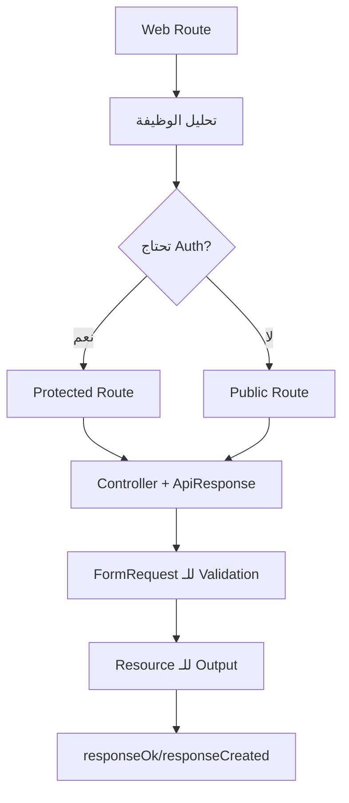

# دليل بناء API - طريقة التفكير والتنفيذ

هذا المستند يوثق طريقة التفكير والتنفيذ في بناء APIs لمشروع Laravel. يمكن لأي AI آخر دراسة هذا الملف ثم تحويل أي routes من `web.php` إلى API باستخدام نفس المنهجية.

---

## 1. هيكل الملفات والمجلدات

```
app/
├── Http/
│   ├── Controllers/
│   │   └── Api/                    # جميع API Controllers هنا
│   │       ├── GuestController.php
│   │       ├── ProfileController.php
│   │       ├── HotelController.php
│   │       └── ...
│   ├── Requests/
│   │   └── Api/                    # جميع Form Requests للـ API هنا
│   │       ├── LoginRequest.php
│   │       ├── RegisterRequest.php
│   │       └── ...
│   └── Resources/                  # جميع API Resources هنا
│       ├── UserResource.php
│       ├── HotelResource.php
│       └── ...
├── Traits/
│   └── ApiResponse.php             # Trait موحد للـ JSON Responses
└── Models/                         # Models موجودة مسبقاً
routes/
└── api.php                         # ملف تعريف الـ API Routes
```

---

## 2. الـ ApiResponse Trait (إلزامي)

> [!IMPORTANT]
> كل Controller في مجلد `Api/` يجب أن يستخدم هذا الـ Trait لتوحيد شكل الـ Response.

### هيكل الـ Response الموحد:

```json
{
    "success": true,
    "status": 200,
    "message": "رسالة توضيحية",
    "data": { ... },
    "paginate": {
        "per_page": 15,
        "current_page": 1,
        "last_page": 10
    }
}
```

### الـ Methods المتاحة:

| Method                                    | الاستخدام   | HTTP Status |
| ----------------------------------------- | ----------- | ----------- |
| `responseOk($message, $data, $paginate)`  | نجاح عام    | 200         |
| `responseCreated($message, $data)`        | إنشاء/تسجيل | 201         |
| `responseError($message, $data, $status)` | أخطاء عامة  | 400         |
| `responseUnauthorized()`                  | غير مصرح    | 401         |
| `responseNotFound()`                      | غير موجود   | 404         |
| `responseInternalError()`                 | خطأ سيرفر   | 500         |

### مثال الاستخدام:

```php
use App\Traits\ApiResponse;

class HotelController extends Controller
{
    use ApiResponse;

    public function hotels(Request $request)
    {
        $hotels = Hotel::paginate(15);
        return $this->responseOk(
            message: __('lang.hotel'),
            data: HotelResource::collection($hotels),
            paginate: true
        );
    }
}
```

---

## 3. تنظيم الـ Routes (طريقة التفكير)

### المبادئ الأساسية:

1. **تجميع Routes حسب الوظيفة** - كل مجموعة routes متعلقة ببعض في `group`
2. **استخدام `prefix`** - لتحديد المسار الأساسي
3. **استخدام `controller`** - لتحديد الـ Controller مرة واحدة
4. **فصل Public و Protected Routes** - باستخدام `auth:sanctum` middleware

### هيكل الـ Routes:

```php
<?php

use Illuminate\Support\Facades\Route;

// ═══════════════════════════════════════════════════════════════
// PUBLIC ROUTES (بدون Authentication)
// ═══════════════════════════════════════════════════════════════

// Guest Routes (تسجيل/دخول)
Route::controller(GuestController::class)->group(function () {
    Route::post('/register', 'register');
    Route::post('/login', 'login');
    Route::post('/send/code', 'sendCode');
    Route::post('/verify-code', 'verifyCode');
    Route::post('/reset/password', 'resetPassword');
});

// Data Routes (بيانات عامة)
Route::controller(DataController::class)->group(function () {
    Route::get('/cities', 'cities');
    Route::get('/categories', 'categories');
});

// Resource Routes مع prefix
Route::prefix('hotels')->group(function () {
    Route::controller(HotelController::class)->group(function () {
        Route::get('/', 'hotels');
        Route::get('/details/{hotel}', 'hotelDetails');
    });

    // Nested Resources
    Route::prefix('rooms')->controller(RoomController::class)->group(function () {
        Route::get('/', 'rooms');
        Route::get('/{room}', 'roomDetails');
    });
});

// ═══════════════════════════════════════════════════════════════
// PROTECTED ROUTES (تحتاج Authentication)
// ═══════════════════════════════════════════════════════════════

Route::middleware('auth:sanctum')->group(function () {

    // Favorites
    Route::prefix('favorites')->controller(FavoriteController::class)->group(function () {
        Route::get('/', 'favorites');
        Route::post('/toggle', 'toggleFavorite');
    });

    // Profile
    Route::prefix('profile')->controller(ProfileController::class)->group(function () {
        Route::get('/', 'index');
        Route::post('/update', 'update');
        Route::post('/logout', 'logout');
    });

    // Nested Booking Routes
    Route::prefix('booking')->group(function () {
        Route::prefix('hotels')->controller(HotelBookingController::class)->group(function () {
            Route::get('/', 'myBooking');
            Route::post('/create', 'createBooking');
        });
    });
});
```

### قواعد HTTP Methods:

| Method | الاستخدام                                |
| ------ | ---------------------------------------- |
| `GET`  | جلب البيانات (قراءة فقط)                 |
| `POST` | إنشاء/تعديل/حذف (أي عملية تغير البيانات) |

> [!NOTE]
> في هذا المشروع، لا نستخدم `PUT`, `PATCH`, `DELETE` - كل عمليات التعديل والحذف تتم بـ `POST`.

---

## 4. بناء الـ Controllers

### القالب الأساسي:

```php
<?php

namespace App\Http\Controllers\Api;

use App\Http\Controllers\Controller;
use App\Http\Requests\Api\{RequestClass};
use App\Http\Resources\{ResourceClass};
use App\Models\{Model};
use App\Traits\ApiResponse;
use Illuminate\Http\Request;

class {Name}Controller extends Controller
{
    use ApiResponse;

    // GET - جلب قائمة مع Filtering و Pagination
    public function index(Request $request)
    {
        $items = Model::query()
            ->when($request->filter, fn($q) => $q->where('column', $request->filter))
            ->when($request->search, fn($q) => $q->filter($request->search))
            ->paginate($request->per_page ?? 15);

        return $this->responseOk(
            message: __('lang.items'),
            data: ItemResource::collection($items),
            paginate: true
        );
    }

    // GET - جلب عنصر واحد
    public function show(Model $model)
    {
        return $this->responseOk(
            message: __('lang.item_details'),
            data: new ItemResource($model)
        );
    }

    // POST - إنشاء عنصر
    public function store(CreateRequest $request)
    {
        $item = Model::create($request->validated());

        return $this->responseCreated(
            message: __('lang.created_successfully'),
            data: new ItemResource($item)
        );
    }

    // POST - تحديث عنصر
    public function update(UpdateRequest $request)
    {
        auth()->user()->update($request->validated());

        return $this->responseOk(
            message: __('lang.updated_successfully'),
            data: new ItemResource(auth()->user())
        );
    }

    // POST - حذف عنصر
    public function destroy(Request $request)
    {
        Model::findOrFail($request->id)->delete();

        return $this->responseOk(message: __('lang.deleted_successfully'));
    }
}
```

### أنماط الـ Query Building:

```php
// 1. Filtering بالـ when
$hotels = Hotel::status(Status::Active)
    ->when($request->name, fn($q) => $q->filter($request->name))
    ->when($request->city_id, fn($q) => $q->where('city_id', $request->city_id))
    ->when($request->rating, fn($q) => $q->orderBy('rating', $request->rating))
    ->paginate($request->per_page ?? 15);

// 2. Nested Filtering
->when($request->adults_count, function ($q) use ($request) {
    $q->whereHas('rooms', fn($q) => $q->where('adults_count', $request->adults_count)
        ->when($request->children_count, fn($q2) => $q2->where('children_count', $request->children_count))
    );
})

// 3. Boolean Filtering
->when($request->is_featured, function ($q) use ($request) {
    $isFeatured = filter_var($request->is_featured, FILTER_VALIDATE_BOOLEAN);
    $q->whereHas('rooms', fn($q) => $q->where('is_featured', $isFeatured ? 1 : 0));
})
```

---

## 5. بناء الـ Form Requests

### الموقع: `app/Http/Requests/Api/`

### القالب الأساسي:

```php
<?php

namespace App\Http\Requests\Api;

use App\Traits\ApiResponse;
use Illuminate\Foundation\Http\FormRequest;
use Illuminate\Validation\Validator;

class {Name}Request extends FormRequest
{
    use ApiResponse;  // إلزامي للـ API Requests

    public function authorize(): bool
    {
        return true;
    }

    public function rules(): array
    {
        return [
            'email' => ['bail', 'required', 'email'],
            'password' => ['bail', 'required', 'min:8'],
            'name' => ['required', 'string', 'max:255'],
            'image' => ['nullable', 'image', 'mimes:jpg,png', 'max:2048'],
        ];
    }

    // Optional: Custom Validation Logic
    public function after(): array
    {
        return [
            function (Validator $validator) {
                // Custom validation after rules pass
                if (! auth()->attempt(['email' => $this->email, 'password' => $this->password])) {
                    $validator->errors()->add('password', __('auth.failed'));
                }
            },
        ];
    }
}
```

> [!TIP]
> استخدام `bail` في القواعد يوقف الـ Validation عند أول خطأ - مفيد للـ API.

---

## 6. بناء الـ API Resources

### الموقع: `app/Http/Resources/`

### القالب الأساسي:

```php
<?php

namespace App\Http\Resources;

use App\Services\FileService;
use Illuminate\Http\Request;
use Illuminate\Http\Resources\Json\JsonResource;

class {Name}Resource extends JsonResource
{
    public function toArray(Request $request): array
    {
        return [
            'id' => $this->id,
            'name' => $this->name,
            'email' => $this->email,
            // Images - استخدم FileService للـ URLs
            'image' => FileService::get($this->image),
            // Relations - استخدم Resources
            'city' => new CityResource($this->whenLoaded('city')),
            'rooms' => RoomResource::collection($this->whenLoaded('rooms')),
            // Computed values
            'total_price' => $this->calculateTotal(),
            // Type casting
            'rating' => (int) $this->rating,
            'is_active' => (bool) $this->is_active,
        ];
    }
}
```

### أنواع الـ Resources:

| نوع                            | الاستخدام         | مثال                            |
| ------------------------------ | ----------------- | ------------------------------- |
| `{Name}Resource`               | تفاصيل كاملة      | `HotelResource`                 |
| `{Name}SimpleResource`         | قوائم مختصرة      | `HotelSimpleResource`           |
| `{Name}With{Relation}Resource` | مع relation محددة | `HotelWithCheapestRoomResource` |

---

## 7. تحويل Web Route إلى API (خطوة بخطوة)

### مثال: تحويل Products من Web إلى API

#### 1️⃣ حلل الـ Web Route:

```php
// routes/web.php
Route::get('/products', [ProductController::class, 'index']);
Route::get('/products/{product}', [ProductController::class, 'show']);
Route::post('/products', [ProductController::class, 'store'])->middleware('auth');
```

#### 2️⃣ أنشئ API Controller:

```bash
# الموقع: app/Http/Controllers/Api/ProductController.php
```

```php
<?php

namespace App\Http\Controllers\Api;

use App\Http\Controllers\Controller;
use App\Http\Resources\ProductResource;
use App\Http\Resources\ProductSimpleResource;
use App\Models\Product;
use App\Traits\ApiResponse;
use Illuminate\Http\Request;

class ProductController extends Controller
{
    use ApiResponse;

    public function products(Request $request)
    {
        $products = Product::active()
            ->when($request->category_id, fn($q) => $q->where('category_id', $request->category_id))
            ->when($request->search, fn($q) => $q->filter($request->search))
            ->paginate($request->per_page ?? 15);

        return $this->responseOk(
            message: __('lang.products'),
            data: ProductSimpleResource::collection($products),
            paginate: true
        );
    }

    public function productDetails(Product $product)
    {
        return $this->responseOk(
            message: __('lang.product_details'),
            data: new ProductResource($product)
        );
    }
}
```

#### 3️⃣ أنشئ Resources:

```php
// app/Http/Resources/ProductSimpleResource.php
class ProductSimpleResource extends JsonResource
{
    public function toArray(Request $request): array
    {
        return [
            'id' => $this->id,
            'name' => $this->name,
            'price' => $this->price,
            'image' => FileService::get($this->main_image),
        ];
    }
}

// app/Http/Resources/ProductResource.php
class ProductResource extends JsonResource
{
    public function toArray(Request $request): array
    {
        return [
            'id' => $this->id,
            'name' => $this->name,
            'description' => $this->description,
            'price' => $this->price,
            'images' => $this->images->map(fn($img) => FileService::get($img->path)),
            'category' => new CategoryResource($this->category),
            'variants' => VariantResource::collection($this->variants),
        ];
    }
}
```

#### 4️⃣ أضف Routes:

```php
// routes/api.php

// Public
Route::prefix('products')->controller(ProductController::class)->group(function () {
    Route::get('/', 'products');
    Route::get('/{product}', 'productDetails');
});

// Protected (إذا لزم)
Route::middleware('auth:sanctum')->group(function () {
    Route::prefix('products')->controller(ProductController::class)->group(function () {
        Route::post('/create', 'createProduct');
    });
});
```

---

## 8. قائمة المراجعة (Checklist)

عند إنشاء API جديد، تأكد من:

- [ ] الـ Controller في `app/Http/Controllers/Api/`
- [ ] الـ Controller يستخدم `use ApiResponse`
- [ ] الـ Request في `app/Http/Requests/Api/`
- [ ] الـ Request يستخدم `use ApiResponse`
- [ ] الـ Resource في `app/Http/Resources/`
- [ ] الـ Route في `routes/api.php`
- [ ] الـ Routes المحمية داخل `middleware('auth:sanctum')`
- [ ] استخدام `__('lang.key')` للترجمة
- [ ] استخدام `paginate: true` مع القوائم
- [ ] استخدام `FileService::get()` للصور

---

## 9. الترجمات (Localization)

كل رسائل الـ API تستخدم ملفات الترجمة:

```php
// في Controller
return $this->responseOk(message: __('lang.hotel'));

// في lang/ar/lang.php
'hotel' => 'الفنادق',
'hotel_details' => 'تفاصيل الفندق',
'created_successfully' => 'تم الإنشاء بنجاح',
'updated_successfully' => 'تم التحديث بنجاح',
'deleted_successfully' => 'تم الحذف بنجاح',
```

---

## 10. ملخص سريع



---

> [!CAUTION] > **تذكر دائماً:**
>
> - لا تُعيد الـ Model مباشرة، استخدم Resource
> - لا تكتب Response يدوياً، استخدم ApiResponse methods
> - لا تضع validation في Controller، استخدم FormRequest
